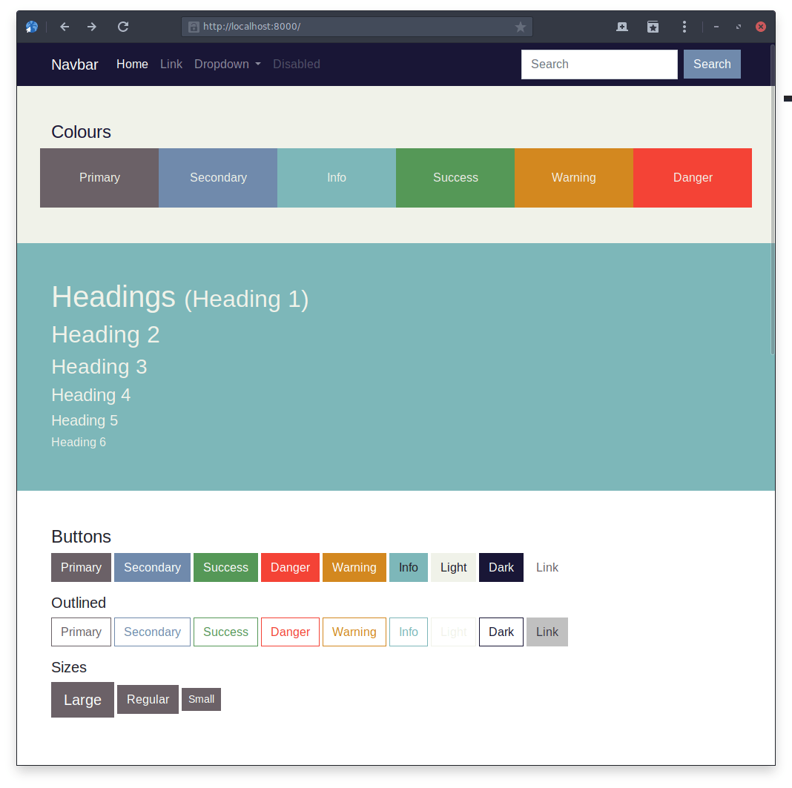

# Example Project

An example site is included in the `example` directory of this package. The login is:

| Username | Password |
| -------- | -------- |
| `admin`  | `demo`   |

To demonstrate how the package can be used to serve a different Bootstrap theme for each site in a multi-site installation, the example site contains three [`BootstrapTheme`](models.md#bootstraptheme) entries, each with a corresponding [`SiteBootstrapTheme`](models.md#sitebootstraptheme).

Each theme and its associated site is detailed below.

## Default Theme

The default Bootstrap theme is available when visiting `http://127.0.0.1:8000/`.

## Custom Theme 1

A customized Bootstrap theme is available when visiting `http://localhost:8000/`.

## Custom Theme 2

A second customized Bootstrap theme is available when visiting `http://0.0.0.0:8000/`.

